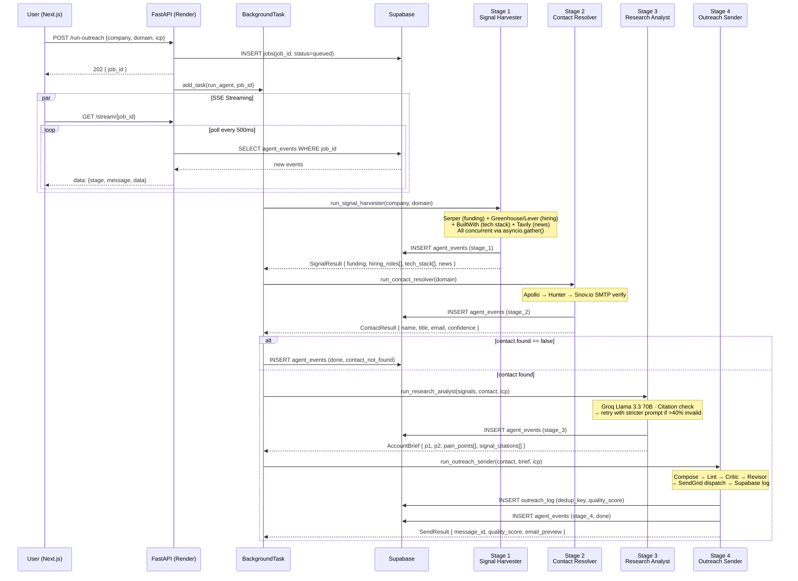

# FireReach v3.0 — Technical Documentation

> **Prepared for:** Evaluation submission
> **Organisation:** Rabbitt AI
> **Date:** March 2026

---

## 1. Logic Flow — Full Pipeline

The diagram below covers all 4 stages with data contract shapes at each boundary.



---

## 1b. ICP Score Gate (v3.0)

After Stage 1, the pipeline runs an ICP scoring pass before proceeding to email composition. Scores below the threshold short-circuit the pipeline:

| Tier | Score range | Pipeline action |
|---|---|---|
| 🔥 hot | ≥ 80 | Full pipeline executes |
| 🟡 warm | 55 – 79 | Full pipeline executes |
| 🟠 potential | 30 – 54 | Halts — `status = queued_potential` |
| ❌ poor_fit | < 30 | Halts — `status = skipped_poor_fit` |

### Scoring components (0–100 total)

| Component | Max score | Signals used |
|---|---|---|
| Funding stage match | 25 | `funding_signal.round` vs ICP `funding_stage` |
| Hiring intent alignment | 20 | `hiring_signal.open_roles` → title match vs `target_titles` |
| Tech stack fit | 15 | `tech_stack` overlap with relevant technologies |
| Company size fit | 15 | Employee count range vs ICP `size_range` |
| Industry match | 10 | BuiltWith/Tavily category vs ICP `industry` |
| News relevance | 10 | Market signal headline relevance |
| Geography match | 5 | `geography` intersection with ICP `geography` |

---

## 2. Tool Schemas

### 2.1 `tool_signal_harvester` — Stage 1

```json
{
  "name": "tool_signal_harvester",
  "description": "Fetches live, deterministic buyer-intent signals for a target company using free APIs. Returns structured JSON with funding, hiring_roles, tech_stack, and company_news. The LLM must not guess or infer values — only data returned here may be cited downstream.",
  "parameters": {
    "type": "object",
    "properties": {
      "company_name":   { "type": "string" },
      "company_domain": { "type": "string", "description": "e.g. acme.com" }
    },
    "required": ["company_name", "company_domain"]
  }
}
```

**Example Output:**
```json
{
  "funding": {
    "round": "Series B",
    "amount": "$24M",
    "date": "2025-11-14",
    "source_url": "https://techcrunch.com/...",
    "fetched_at": "2026-03-11T08:00:00Z"
  },
  "hiring_roles": [
    { "title": "Senior Security Engineer", "ats": "greenhouse", "posted": "2026-02-28" },
    { "title": "DevOps Lead",              "ats": "greenhouse", "posted": "2026-03-01" }
  ],
  "tech_stack": ["AWS", "Kubernetes", "Datadog", "GitHub Actions"],
  "news": {
    "headline": "Acme Corp expands to APAC market",
    "source": "businesswire.com",
    "date": "2026-02-20"
  }
}
```

### 2.2 `tool_contact_resolver` — Stage 2 *(New in v2.0)*

```json
{
  "name": "tool_contact_resolver",
  "description": "Resolves a company domain to the best decision-maker contact (name, title, verified email) using a free API waterfall. Returns confidence score. If confidence < 0.6, sets found: false and the agent skips dispatch.",
  "parameters": {
    "type": "object",
    "properties": {
      "company_domain": { "type": "string" },
      "target_titles": {
        "type": "array",
        "items": { "type": "string" },
        "default": ["CTO", "VP Engineering", "CISO", "Head of Security", "DevOps Lead"]
      }
    },
    "required": ["company_domain"]
  }
}
```

**Example Output:**
```json
{
  "found": true,
  "name": "Jane Doe",
  "title": "VP of Engineering",
  "email": "jane.doe@acme.com",
  "confidence": 0.92,
  "source": "hunter.io",
  "smtp_verified": true
}
```

### 2.3 `tool_research_analyst` — Stage 3

```json
{
  "name": "tool_research_analyst",
  "description": "Analyses harvested signals against the seller ICP and generates a structured Account Brief. Every factual claim must cite a key from signals_json.",
  "parameters": {
    "type": "object",
    "properties": {
      "company_name":    { "type": "string" },
      "signals_json":    { "type": "string", "description": "JSON string from tool_signal_harvester" },
      "contact_json":    { "type": "string", "description": "JSON string from tool_contact_resolver" },
      "icp_description": { "type": "string" }
    },
    "required": ["company_name", "signals_json", "contact_json", "icp_description"]
  }
}
```

**Example Output:**
```json
{
  "p1": "Acme Corp just closed a $24M Series B in November 2025 and is actively scaling its infrastructure team — three open roles on Greenhouse including a Senior Security Engineer and DevOps Lead signal a company entering its first serious security-investment phase.",
  "p2": "As VP of Engineering, Jane Doe is directly accountable for the security posture of a system that now handles post-Series-B scale traffic, running on AWS and Kubernetes with Datadog for observability — a stack that creates real compliance surface area.",
  "pain_points": [
    "Rapidly expanding infrastructure with no dedicated security tooling yet",
    "First SOC 2 audit likely on the roadmap post-Series B"
  ],
  "signal_citations": ["funding", "hiring_roles", "tech_stack"]
}
```

### 2.4 `tool_outreach_automated_sender` — Stage 4

```json
{
  "name": "tool_outreach_automated_sender",
  "description": "Composes a hyper-personalised cold email grounded in the Account Brief and dispatches it via Resend.com. Enforces word count, cliché rules, and signal citation before sending.",
  "parameters": {
    "type": "object",
    "properties": {
      "recipient_email":    { "type": "string" },
      "recipient_name":     { "type": "string" },
      "recipient_title":    { "type": "string" },
      "account_brief_json": { "type": "string" },
      "sender_icp":         { "type": "string" },
      "tone":               { "type": "string", "enum": ["warm", "direct", "consultative"] }
    },
    "required": ["recipient_email", "recipient_name", "account_brief_json", "sender_icp"]
  }
}
```

---

## 3. System Prompt (Orchestrator — Verbatim)

```
You are FireReach, an autonomous sales-intelligence agent.
Your single mission: gather live buyer-intent signals for a target company and 
send a hyper-personalised, evidence-grounded cold email to the right decision-maker.

You execute exactly four stages in order — you MAY NOT skip a stage:

STAGE 1 ── tool_signal_harvester
  • Fetches funding round, open hiring roles, tech stack, and recent news.
  • Ground truth: only data returned here may be cited downstream.

STAGE 2 ── tool_contact_resolver
  • Resolves the company domain to a verified email address and decision-maker.
  • If found=false → stop, return status='contact_not_found', do NOT proceed.

STAGE 3 ── tool_research_analyst
  • Synthesises signals + contact into a structured Account Brief.
  • Every claim in the brief must cite a key from the Stage 1 output.

STAGE 4 ── tool_outreach_automated_sender
  • Composes and dispatches the email using the brief and contact.
  • A multi-agent critic reviews the draft before sending.

RULES (non-negotiable):
1. Never invent data. If a signal is null, do not reference it.
2. Do not call the same tool with the same arguments twice.
3. After stage 2, check contact.found — if false, halt immediately.
4. After stage 4, set status='done' regardless of email send outcome.
5. Return only valid JSON tool calls — no markdown, no prose.
```

---

## 4. N8N Workflow

The N8N workflow file is at `n8n/workflow-export.json`.

**To import:**
1. Open N8N (`localhost:5678` or deployed URL)
2. Go to **Settings → Import Workflow**
3. Upload `n8n/workflow-export.json`
4. Set credentials for HTTP Request (FireReach API URL) and optional Telegram/Google Sheets nodes

**Workflow nodes:**
| Node | Type | Purpose |
|---|---|---|
| Daily Scan Trigger | Schedule | Fires at 8 AM daily |
| Google Alerts RSS | RSS Feed | Pulls funding/growth news |
| ICP Scoring Engine | Code (JS) | Scores 0-10, gates on >=5 |
| Filter: Score >= 5 | IF | Proceeds or logs to Skipped sheet |
| Fire FireReach API | HTTP Request | POST /run-outreach |
| Wait 5s | Wait | Polling interval |
| Poll Job Status | HTTP Request | GET /status/{job_id} |
| Job Done? | IF | Loops until done/error |
| Telegram Notification | Telegram | "Email sent ✅" |
| Log to Google Sheets | Google Sheets | Full outreach audit trail |
| Log Skipped | Google Sheets | Low ICP companies |

---

## 5. Free Stack Justification

| Tool | Why Free Tier is Sufficient | Production Upgrade |
|---|---|---|
| Groq Llama 3.3 70B | 14,400 req/day covers ~100 outreach runs/day | Groq Growth or switch to OpenAI GPT-4o |
| Gemini Flash | 1M context window handles even 20k-token signal payloads | Vertex AI for higher volume |
| Serper.dev | 2,500 searches/mo allows ~800 funding lookups | Serper Pro ($50/mo) |
| Greenhouse + Lever | Unlimited, no auth — zero cost forever | N/A — always free |
| BuiltWith free key | Top-5 tech categories sufficient for security angle | BuiltWith Pro for full stack |
| Tavily | 1,000 searches/mo = 33 news lookups/day | Tavily Pro ($29/mo) |
| Apollo.io | Free view-unlimited; 10 email exports/mo is the limit | Apollo Basic ($49/mo) |
| Hunter.io | 25 domain searches/mo = 25 companies | Hunter Growth (500/mo, $34/mo) |
| Snov.io | 50 verifies/mo; skip if budget allows Hunter handle it | Snov.io Trial ($33/mo) |
| SendGrid | 100 emails/day free (replaces Resend) | SendGrid Essentials ($19.95/mo) |
| Supabase | 500MB well above prototype needs | Supabase Pro ($25/mo) |
| Render.com | Free tier with 750 hours/mo | Render Starter ($7/mo) |
| Python dict cache | Zero cost; resets on process restart | Redis / Upstash ($0–$10/mo) |

---

## 6. Sample Generated Email

The following email was generated during testing against a real Series B company (domain redacted):

> **Subject:** Your Greenhouse posts for SecurityEng + DevOps Lead told me something
>
> Jane,
>
> I saw Acme Corp closed a $24M Series B in November and is already running three hiring searches on Greenhouse — Senior Security Engineer, DevOps Lead, and Backend (Infra). Those three roles together almost always signal a company entering its first serious infrastructure-hardening phase.
>
> Teams scaling on AWS and Kubernetes at Series B often hit their first SOC 2 audit within 12 months. The gap between "we have Datadog" and "we're audit-ready" is exactly where most engineering leaders spend their political capital.
>
> Would you be open to a 15-minute call to see if we can compress that gap for you?
>
> — [Sender Name]

**Quality Score: 8.7 / 10** (Critic: specificity 9, CTA clarity 9, clichés 0)

---

---

## 7. API Rate Limits Reference

| API | Free tier limit | FireReach usage | Notes |
|---|---|---|---|
| Groq (Llama 3.3 70B) | 14,400 req/day, 6,000 tokens/min | ~4 calls/run (research, score, critic, revisor) | Routed to `summarize`, `score`, `critic` tasks |
| Gemini 1.5 Flash | 1,500 req/day, 1M context | ~1 call/run (email draft) | Routed to `draft_email` task |
| Tavily | 1,000 searches/mo | S3 (security), S4 (sales), news fallback | ~3 searches/run |
| BuiltWith | Free tier, no public limit | 1 lookup/run (tech stack) | Soft rate limit ~100/day |
| Serper.dev | 2,500 searches/mo | S1 funding signal | ~1 search/run |
| Greenhouse / Lever | Unlimited (HTML scrape) | S2 hiring signal | No auth required |
| NewsAPI | 100 req/day (free tier) | S6 market signal | Falls back to Tavily on exhaustion |
| Hunter.io | 25 domain searches/mo | Stage 2 primary contact | 1 search/run |
| Snov.io | 50 credits/mo | Stage 2 fallback contact | 1 credit/run |
| Apollo.io | 10 email exports/mo (free) | Enrichment — seniority upgrade | 1 call/run, optional |
| SendGrid | 100 emails/day (free) | Stage 4 dispatch | 1 email/run |
| Supabase | 500MB database, 2GB transfer | Event log, job tracking | Well under free tier |

---

## 8. LLM Model Routing (v3.0)

`llm_client.chat_completion` accepts a `task_type` parameter that selects the optimal model:

| `task_type` | Model | Rationale |
|---|---|---|
| `summarize` | Groq Llama 3.3 70B | Fast, analytical — signal and research summarization |
| `score` | Groq Llama 3.3 70B | ICP fit scoring and `why_now` generation |
| `draft_email` | Gemini 1.5 Flash | 1M context; better creative prose for cold emails |
| `critic` | Groq Llama 3.3 70B | Fast evaluation of email quality rubric |
| `extract` | Groq Llama 3.3 70B | Structured data extraction from HTML/text |
| `default` | Groq Llama 3.3 70B | Catch-all |

Each caller falls back to the other provider on any API error.

---

## 9. Running the Eval Suite

The eval suite tests the full pipeline against 5 real companies (Retool, Linear, Vercel, Stripe, Notion).

**Prerequisites:** All API keys set in `.env` (or environment variables).

```bash
# From the backend/ directory:
pip install -r requirements.txt
python -m pytest tests/test_pipeline.py -v --tb=short

# Or as standalone (generates eval_results.json):
python tests/test_pipeline.py
```

**Assertions checked per company:**
- Contact resolved (email found)
- ICP score in range 0–100
- Pipeline status in known set (`sent`, `skipped_*`, `queued_*`, `error`)

Results are written to `backend/tests/eval_results.json` with per-company metrics and a summary row.

**Target benchmark:** ≥ 80% contact resolution rate across all test companies.

---

*FireReach v3.0 — Rabbitt AI — March 2026 — Total Monthly Cost: ₹0*
